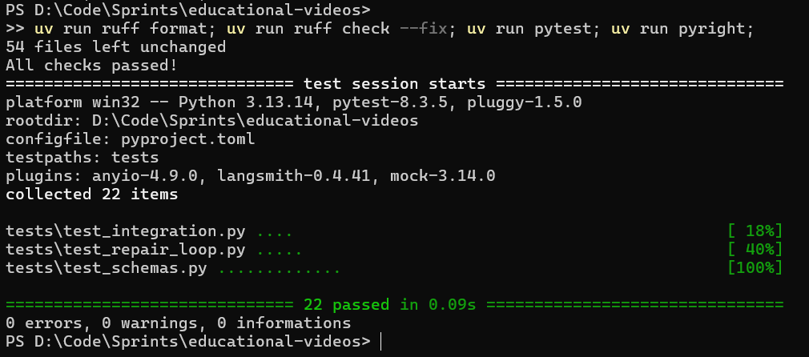

# Working Together on This Repo

## 📜 Repository rules

1. Create a new branch for each task using this format:

   ```text
   G2-<branch_type>-<task_name>-<initials>
   ```

   * `branch_type`:

     * `FT` for features
     * `FX` for fixes
   * `task_name`: use kebab-case. Example: `prompt-engineering-layer`
   * `initials`: first-name and last-name initials. Example: `DM`

   Full examples:

   ```text
   G2-FT-vector-database-DM
   G2-FX-vector-size-AA
   G2-FT-prompt-engineering-layer-DM
   ```

2. Do not push directly to `main`.

3. Keep each task in its own branch.

4. Submit completed work through a Pull Request into `main`.

5. Do not commit local secrets, virtual environments, generated caches, IDE files, or archive files.

## ⚙️ Local setup with uv

This repository uses `uv` to manage dependencies and run tools inside the correct project environment.

Prefer:

```powershell
uv run ...
```

over global commands like:

```powershell
python -m ...
```

This keeps pytest, Ruff, Pyright, and project dependencies using the same locked environment.

### 1. Install uv

Install `uv` once globally:

```powershell
python -m pip install -U uv
```

Verify it works:

```powershell
uv --version
```

### 2. Install project dependencies

From the repository root `educational-videos/`:

```powershell
uv sync --all-groups
```

This creates or updates the local project environment, usually `.venv/`, and installs dependencies from:

```text
pyproject.toml
uv.lock
```

The `.venv/` folder is local only. Do not commit it and do not include it in submission archives.

## 🔐 Environment variables

For online LLM evaluation, create a local `.env` file from a copy of `.env.example`:

Then fill in the required values:

```js
LITELLM_BASE_URL=...
LITELLM_API_KEY=...
DEFAULT_MODEL=...
```

The `.env` file is local _secret_ configuration. **Never commit it or include it in submission archives.**

## ✅ Required checks before committing or pushing

Run this one-liner from the repository root before every commit or push:

```powershell
uv run ruff format; uv run ruff check --fix; uv run pytest; uv run pyright;
```

Example of healthy results:  


If you want Ruff to automatically fix safe lint issues, run this before the full check:

```powershell
uv run ruff check . --fix
```

## 🧰 Common development commands

### Format and lint

Format code:

```powershell
uv run ruff format .
```

Check lint rules:

```powershell
uv run ruff check .
```

Check lint rules and auto-fix safe issues:

```powershell
uv run ruff check . --fix
```

### Run tests

Because `pyproject.toml` sets `testpaths = ["tests"]`, this is enough:

```powershell
uv run pytest
```

Run a specific test file:

```powershell
uv run pytest tests/test_schemas.py
uv run pytest tests/test_repair_loop.py
uv run pytest tests/test_integration.py
```

Run tests with extra detail:

```powershell
uv run pytest -v
```

### Run type checking

Run Pyright through uv:

```powershell
uv run pyright
```

Trust this command over global `python -m pyright`, because the global Python environment may not have the project dependencies installed.

### Run evaluation

Run offline evaluation without using an API key:

```powershell
uv run python -m app.core.eval_harness --offline
```

Run online evaluation using the `.env` configuration:

```powershell
uv run python -m app.core.eval_harness
```

Run repair-expected evaluation:

```powershell
uv run python -m app.core.eval_harness --repair-expected --expected tests/fixtures/expected_timelines_invalid.json
```

### Dependency management

Install or sync dependencies after pulling changes:

```powershell
uv sync --all-groups
```

Upgrade only one package in the lockfile:

```powershell
uv lock --upgrade-package pyright
uv sync
```

Avoid broad dependency upgrades right before submission unless necessary.

### Git checks

Check changed files:

```powershell
git status
```

Review changes before staging:

```powershell
git diff
```

Stage files:

```powershell
git add .
```

Commit changes:

```powershell
git commit -m "Describe the change clearly"
```

Push the current branch:

```powershell
git push
```

## 🛠️ Troubleshooting

### • `uv run pytest` cannot import `app`

Make sure `pyproject.toml` contains:

```toml
[tool.pytest.ini_options]
pythonpath = ["."]
testpaths = ["tests"]
```

Then rerun:

```powershell
uv run pytest
```

### • `python -m pyright` shows missing imports, but `uv run pyright` passes

Trust:

```powershell
uv run pyright
```

The global Python environment may not have the repository dependencies installed. This project should be checked through uv.

### • `uv run eval_harness` says program not found

`eval_harness` is a Python module, not a standalone executable.

Use:

```powershell
uv run python -m app.core.eval_harness --offline
```

or, for online evaluation:

```powershell
uv run python -m app.core.eval_harness
```

### • Online evaluation says environment variables are missing

Make sure `.env` exists and contains:

```env
LITELLM_BASE_URL=...
LITELLM_API_KEY=...
DEFAULT_MODEL=...
```

Then run:

```powershell
uv run python -m app.core.eval_harness
```

### • Project folder is very large

This is usually because `.venv/` exists. That is normal locally, but it should not be committed or submitted.

Make sure these are ignored:

```text
.env
.venv/
venv/
.git/
.idea/
.pytest_cache/
.ruff_cache/
__pycache__/
*.pyc
*.zip
*.rar
```
